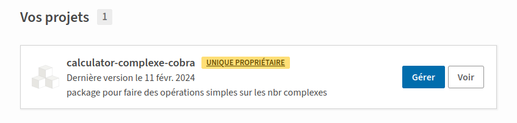

# SUJET_4ETI_AdmCO_20232024_PEINADO

# I. Objectif

Le but de ce TP est de créer un calculateur pouvant réaliser les opérations simples (addition, soustraction, multiplication et division) sur 2 nombres complexes en utilisant la notion de classe et de package.
Il a pour objectif de nous familiariser avec les commandes git et l'utilisation de site tel que https://gitlab.com/ et https://github.com/.
Enfin, plus généralement, ce premier TP avait pour but de nous faire appréhender la gestion d'un projet (avec du code) ainsi que les bonnes pratiques à respecter (plusieurs branches, lisibilité du code,...).

# II. Organisation du projet

Le projet se présente comme ceci :

```.
├── calculator
│   ├── class_calculator.py
│   ├── __init__.py
│   └── __pycache__
│       └── class_calculator.cpython-311.pyc
├── README.md
└── test
    ├── debug.log
    ├── __init__.py
    └── test.py
```
1) Le package calculator :

Ce package permet de contenir la partie fonctionnelle de notre code, le fichier class_calculator.py contient la classe SimpleComplexCalculator qui va réaliser les opérations de base sur deux nombres complexes.

Voici un extrait de la classe SimpleComplexCalculator : 

``` 
class SimpleComplexCalculator:

    def __init__(self,tuple1,tuple2):
        self.tuple1=tuple1
        self.tuple2=tuple2

    def somme(self):
        somme_partie_relle= self.tuple1[0]+self.tuple2[0]
        somme_partie_imaginaire= self.tuple1[1]+self.tuple2[1]
        return somme_partie_relle,somme_partie_imaginaire

    def soustraction(self):
        soustraction_partie_relle= self.tuple1[0]-self.tuple2[0]
        soustraction_partie_imaginaire= self.tuple1[1]-self.tuple2[1]
        return soustraction_partie_relle,soustraction_partie_imaginaire
```
On peut voir que le constructeur de la classe prend en paramètre 2 tuples qui correspondent chacun à un nombre complexe.

2) Le package test :

Ce package nous permet de faire des tests de fonctionnalités sur notre classe SimpleComplexCalculator contenu dans le package calculator.

Pour pouvoir faire des tests en appelant le package calculator, il faut l'importer dans le programme :

```import calculator ``` ou bien ```from calculator import methodes```

On doit ajouter le package calculator dans le Pythonpath pour ne pas avoir d'erreur lors de l'importation dans un programme.

Pour cela une méthode rapide (mais pas optimale) revient à ajouter le chemin de votre package dans directement dans le fichier python path (procédure pour linux): 

Ouvrir le fichier ~/.bashrc et rajouter la ligne suivante :
```
export PYTHONPATH=/chemin_du_package
```
Sauvegarder le fichier.

Voici un extrait de la classe MyTestCase : 

``` 
class MyTestCase(unittest.TestCase):
    '''Classe permettant de tester la classe "class_calculator" '''

    def test_addition(self):
        '''Classe permettant de tester la methode addition '''
        calculateur = SimpleComplexCalculator((1,2), (3,4)) #cas tous se passe bien
        resultat = calculateur.somme()
        calculateur2 = SimpleComplexCalculator((1.5,2), (3,4)) #cas erreur
        resultat2 = calculateur2.somme()
        return self.assertEqual(resultat[0],4), self.assertEqual(resultat[1],6), self.assertEqual(resultat2,"ERROR"), logger.info("Test addition => OK")

    def test_soustraction(self):
        '''Classe permettant de tester la methode soustraction.'''
        calculateur = SimpleComplexCalculator((1,2), (3,4))
        resultat = calculateur.soustraction()
        calculateur2 = SimpleComplexCalculator((1.5,2), (3,4)) #cas erreur
        resultat2 = calculateur2.soustraction()
        return self.assertEqual(resultat[0],-2), self.assertEqual(resultat[1],-2), self.assertEqual(resultat2, "ERROR"), logger.info("Test soustraction => OK")
```

Pour réaliser ces tests on utilise plusieurs librairies :

a) Librairie unittest :

Cette librairie permet d'automatiser des tests, pour l'utiliser on créer une classe et à chaque méthode on définit des tests spécifiques.
Pour utiliser cette librairie : ```import unittest ```

a) Librairie logging :

Cette librairie permet de dialoguer avec l'utilisateur avec des messages d'informations, d'erreurs, et permet de gérer des logs.
Pour utiliser cette librairie : ```import unittest ```

# Applications des bonnes pratiques

1) Pep 8 et Pep 20

Ce projet a été codé en respectant un maximum les règles de bonnes pratiques pep8 et pep20 du langage Python:

Ces règles et leurs utilisations dans le projet ont été détaillés ici : https://gitlab.com/administration-code-2024/exercice-3.git

2) De plus dans l'optique d'améliorer la lisibilité du code, on utilise les programmes black et pylint : (voir installation de ces librairies dans la section "Librairie nécessaires").

a) black : formate le code qu'on lui donne en argument

Utilisation => ```black mon_fichier.py```

Exemple d'affichage de ce programme :
```
reformatted exercice3.py

All done! ✨ 🍰 ✨
1 file reformatted.
```
b) pylint : est un analyseur de code qui permet d'attribuer une note allant de [-10,10] pour le code qu'on lui donne en paramètre en fonction de ses critères de bonnes pratiques/lisibilité du code.

Utilisation => ```pylint mon_fichier.py```

Exemple d'affichage de ce programme :

```
************* Module exercice3
exercice3.py:13:0: C0303: Trailing whitespace (trailing-whitespace)
exercice3.py:14:37: C0303: Trailing whitespace (trailing-whitespace)
exercice3.py:18:0: C0303: Trailing whitespace (trailing-whitespace)
exercice3.py:20:20: C0303: Trailing whitespace (trailing-whitespace)
exercice3.py:34:0: C0325: Unnecessary parens after '=' keyword (superfluous-parens)
exercice3.py:36:0: C0325: Unnecessary parens after '=' keyword (superfluous-parens)
exercice3.py:57:51: C0303: Trailing whitespace (trailing-whitespace)
exercice3.py:65:52: C0303: Trailing whitespace (trailing-whitespace)
exercice3.py:73:55: C0303: Trailing whitespace (trailing-whitespace)
exercice3.py:84:0: C0305: Trailing newlines (trailing-newlines)
exercice3.py:12:0: C0115: Missing class docstring (missing-class-docstring)
exercice3.py:14:22: W0621: Redefining name 'tuple1' from outer scope (line 58) (redefined-outer-name)
exercice3.py:14:29: W0621: Redefining name 'tuple2' from outer scope (line 66) (redefined-outer-name)
exercice3.py:54:0: C0103: Constant name "x1" doesn't conform to UPPER_CASE naming style (invalid-name)
exercice3.py:55:0: C0103: Constant name "y1" doesn't conform to UPPER_CASE naming style (invalid-name)
exercice3.py:62:0: C0103: Constant name "x2" doesn't conform to UPPER_CASE naming style (invalid-name)
exercice3.py:63:0: C0103: Constant name "y2" doesn't conform to UPPER_CASE naming style (invalid-name)

-----------------------------------
Your code has been rated at 4.52/10
```

# Environnement virtuel

Pour ce projet avec l'utilisation de bibliothèques diverses, on souhaite que les fichiers de librairies reste dans le même emplacement, c'est pourquoi on utilise un environnement virtuel :
Pour créer un environnement virtuel avec venv :

1) ```python -m venv <environment name>``` # permet de créer un environnement virtuel
2) ```source env/bin/activate``` # pour activer l'environnement virtuel
3) Pour quitter l'environnement virtuel ```deactivate```

# Librairies nécessaires

Lancer un environnement virtuel (cf section "Environnement virtuel") pour y installer les librairies nécessaires au projet.

Pour installer pip : ```sudo apt install pip```

Pour la partie test :

La librairie unittest est déjà inclue dans python.
Pour installer logging : ```pip install logging```

Pour les bonnes pratiques :

Pour installer pylint : ```pip install pylint```
Pour installer black : ```pip install black```

# Envoi de la partie fonctionnelle en ligne sur le site https://test.pypi.org/

(Procédure adaptée pour un système linux (ubuntu))

```
1) Créer un compte sur https://test.pypi.org/
2) Activer la double authentification.
3) Créer un token pour s'identifier, pour envoyer des codes sur le site.
5) Activer un environnement virtuel
4) sudo apt install python3-wheel python3-setuptools
5) python3 setup.py sdist bdist_wheel 
6) Installer pip (si ce n'est pas déjà fait)
6) pip3 install twine
7) (twine upload dist/calculator-cobra-0.0.1.tar.gz -r pypi) cette commande me retournait erreur HTTPS donc j'ai utilisée la commande suivante :
twine upload -u YOUR-USERNAME -p YOUR-PASSWORD --repository-url https://test.pypi.org/legacy/ dist/*
pour se connecter avec un token mettre pour le paramètre u:  __token__ et pour le mdp = votre token
```

# Récupération du projet en ligne

Pour rendre accessible la partie fonctionnelle du projet (la classe qui réalise les opérations), on le met sur le site https://test.pypi.org/ (cf section précédente) on peut le récupérer avec la commande suivante :

```
pip install -i https://test.pypi.org/simple/ calculator-complexe-cobra
```
Ci-dessous on peut voir que le fichier a bien été mis en ligne sur le site :



# Liens vers gitlab

Le projet a été fait pas à pas et les différents exercices correspondent aux différentes étapes de sa construction.
Dans chaque exercice un REAME.txt a été fait expliquant l'objectif de l'exercice ainsi que des précisions sur le code.

Exercice 0 : https://gitlab.com/administration-code-2024/exercice-0.git

Exercice 1 : https://gitlab.com/administration-code-2024/exercice-1.git

Exercice 2 : https://gitlab.com/administration-code-2024/exercice-2.git

Exercice 3 : https://gitlab.com/administration-code-2024/exercice-3.git

Exercice 4 : https://gitlab.com/administration-code-2024/exercice-4.git

Exercice 5 : https://gitlab.com/administration-code-2024/exercice-5.git

Exercice 6 : https://gitlab.com/administration-code-2024/exercice-6.git

Exercice 7 : https://gitlab.com/administration-code-2024/exercice-7.git

Exercice 8 : https://gitlab.com/administration-code-2024/exercice-8.git

Exercice 9 : https://gitlab.com/administration-code-2024/exercice-9.git

Exercice 10 : https://gitlab.com/administration-code-2024/exercice-10.git

Exercice 12 : https://gitlab.com/administration-code-2024/exercice-12.git

# Ressources

Plateforme de mise en ligne de package Python : https://test.pypi.org/

Commandes gitlab : https://docs.gitlab.com/ee/gitlab-basics/start-using-git.html

Énoncé du sujet : https://github.com/fabricejumel/SUJET_4ETI_AdmCO_20232024/?tab=readme-ov-file
